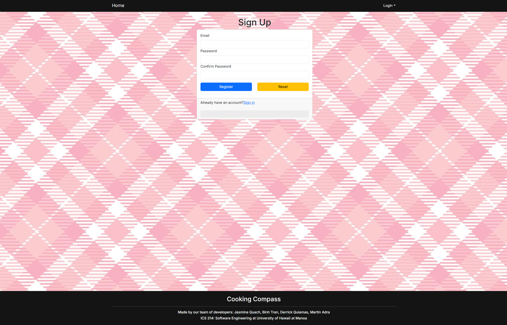
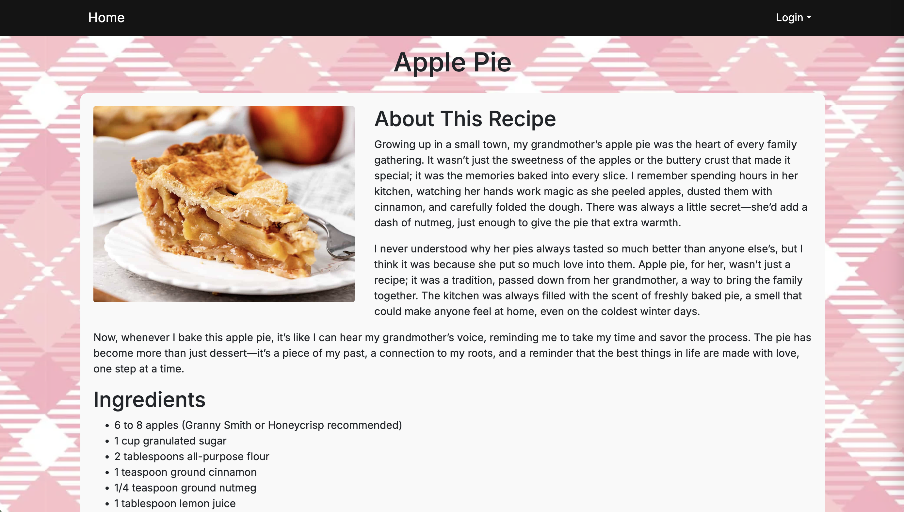

## **Table of Contents**
* [Overview](#overview)
* [The Techy Stuff](#the-techy-stuff)
* [Mockups](#mockups)
* [Deployment](#deployment)
* [User Guide](#user-guide)
* [Meet the Developers](#meet-the-developers)

## **Overview**
Cooking Compass is an application that allows UH Mānoa students to share and search for creative recipes that respect the constraints—limited kitchen resources, cooking skills, time—many college-goers face. By providing opportunites to find creative, *doable* recipes, we aim to foster a community that celebrates resourcefulness, healthy eating, and the joy of cooking.

## **The Techy Stuff**
* See our [GitHub organization](https://github.com/Cooking-Compass).
* See our [team contract](https://docs.google.com/document/d/1vPueASUJx5Af_aTIyjsdGVoajnHm5Qxhm5PrnRTxdoA/edit?usp=sharing).
* See our [deployment page](https://cooking-compass-khaki.vercel.app/). (Just placed here for now.)

## **Milestones**
* [Project Milestone 1](https://github.com/orgs/Cooking-Compass/projects/1)
* [Project Milestone 2](https://github.com/orgs/Cooking-Compass/projects/2)
* [Project Milestone 3](https://github.com/orgs/Cooking-Compass/projects/3)

## **Mockups**

<h3><strong>Landing Page</strong></h3>


<div style="display: flex; flex-wrap: wrap; gap: 40px; justify-content: center;">

  <div style="flex: 1 1 45%; text-align: center;">
    <h3><strong>Sign-up Page</strong></h3>
    
  </div>

  <div style="flex: 1 1 45%; text-align: center;">
    <h3><strong>Sign-in Page</strong></h3>
    
  </div>

  <div style="flex: 1 1 45%; text-align: center;">
    <h3><strong>Individual Recipe Page</strong></h3>
    
  </div>

  <div style="flex: 1 1 45%; text-align: center;">
    <h3><strong>Recipe Submit Page</strong></h3>
    
  </div>

</div>

## **Deployment**

* [Vercel Deployment](https://cooking-compass-khaki.vercel.app/)

## **User Guide**
TO-DO!

## **Meet the Developers**

<div>
  <table style="margin: 0 auto; border-collapse: separate; border-spacing: 10px;">
    <tr>
      <td style="width: 200px; vertical-align: top; text-align: center;">
        <h3 style="margin-bottom: 10px;">Derrick</h3>
        <br>
        <p style="font-size: 13px; margin-top: 8px;">
          Majoring in ICS to eventually be in Game Development.
        </p>
      </td>
      <td style="width: 200px; vertical-align: top; text-align: center;">
        <h3 style="margin-bottom: 10px;">Jasmine</h3>
        <br>
        <p style="font-size: 13px; margin-top: 8px;">
        Majoring in ICS and minoring in Philosophy.
        <a href="https://www.linkedin.com/in/jasminequach/" target="_blank">LinkedIn</a>
        </p>
      </td>
      <td style="width: 200px; vertical-align: top; text-align: center;">
        <h3 style="margin-bottom: 10px;">Martin</h3>
        <br>
        <p style="font-size: 13px; margin-top: 8px;">
        Majoring in Astrophysics and Minoring in ICS.
        <a href="https://www.linkedin.com/in/martin-adra-40a06b1b9" target="_blank">LinkedIn</a>
        </p>
      </td>
      <td style="width: 200px; vertical-align: top; text-align: center;">
        <h3 style="margin-bottom: 10px;">Binh</h3>
        <br>
        <p style="font-size: 13px; margin-top: 8px;">
        Majoring in ICS with an interest in Cybersecurity.
        </p>
      </td>
    </tr>
  </table>
</div>

<hr />

## Wish to install and view our program?

First, you'll want to clone the repository to your own desktop. That requires permitted access so feel free to request access. 
The link to the repository can be found [here](https://github.com/Cooking-Compass/cooking-compass).

Second, as this uses postgres to create and maintain databases, you'll need to install it. You can install it through [here](https://www.postgresql.org/download/). 

Once you open the repository into your environment, proceed to the terminal and create that database. 

```

$ createdb testing
Password: (enter password here)
$

```

NPM and Node.js is both needed for this, so have those too. Then you can proceed to terminal and type:

```

$ npm install

```

After that, create a `.env` file from the `sample.env`. Set the `DATABASE_URL` variable to match your PostgreSQL database that you created in the first step. See the Prisma docs [Connect your database](https://www.prisma.io/docs/getting-started/setup-prisma/add-to-existing-project/relational-databases/connect-your-database-typescript-postgresql). Then run the Prisma migration `npx prisma migrate dev` to set up the PostgreSQL tables.

```

$ npx prisma migrate dev
Environment variables loaded from .env
Prisma schema loaded from prisma/schema.prisma
Datasource "db": PostgreSQL database "<your database name>", schema "public" at "localhost:5432"

Applying migration `20240708195109_init`

The following migration(s) have been applied:

migrations/
└─ 20240708195109_init/
└─ migration.sql

Your database is now in sync with your schema.

✔ Generated Prisma Client (v5.16.1) to ./node_modules/@prisma/client in 51ms

$

```

Then seed the database with the `/config/settings.development.json` data using `npx prisma db seed`.

```

$ npx prisma db seed
Environment variables loaded from .env
Running seed command `ts-node --compiler-options {"module":"CommonJS"} prisma/seed.ts` ...
Seeding the database
Creating user: admin@foo.com with role: ADMIN
Creating user: john@foo.com with role: USER
Adding Contacts: ....

🌱 The seed command has been executed.
$

```

### Now, here is how to start it up locally:

Once the libraries are installed and the database seeded, you can run the application by invoking the "dev" script in the [package.json file](https://github.com/ics-software-engineering/nextjs-application-template/blob/master/app/package.json):

```

$ npm run dev

> nextjs-application-template-1@0.1.0 dev
> next dev

▲ Next.js 14.2.4

- Local: http://localhost:3000
- Environments: .env

✓ Starting...
✓ Ready in 1619ms

```

### Viewing the running app:

If all goes well, the application will appear at [http://localhost:3000](http://localhost:3000). You can login using the credentials in [settings.development.json](https://github.com/ics-software-engineering/nextjs-application-template/blob/main/config/settings.development.json), or else register a new account.

### ESLint

You can verify that the code obeys our coding standards by running ESLint over the code in the src/ directory with:

```
$ npm run lint

> nextjs-application-template-1@0.1.0 lint
> next lint

✔ No ESLint warnings or errors
$
```


### User Interface Walkthrough

#### Landing Page

When you first bring up the application, you will see the landing page that provides a brief introduction to the capabilities of Cooking Compass:


#### About

Clicking on the 'About' link brings up a page containing information about the app, our vision, and frequently asked questions.


#### Sign Up

If you do not yet have an account on the system, you can register by clicking on 'Login', then 'Sign Up':


#### Sign In

Click on the Login link, then click on the Signin link to bring up the Sign In page which allows you to login:


#### Submit Recipe

After successfully logging in, the user will be taken back to the homepage, but now they will be able to submit recipes. Clicking on the 'Submit a Recipe' link will bring up this page:


#### List Recipe

Clicking on the Explore link brings up a page that lists all of the recipes that have been submitted to the application.


#### Individual Recipe

From the Explore page, the user can click on individual recipes to bring up a page dedicated to that specific recipe.


