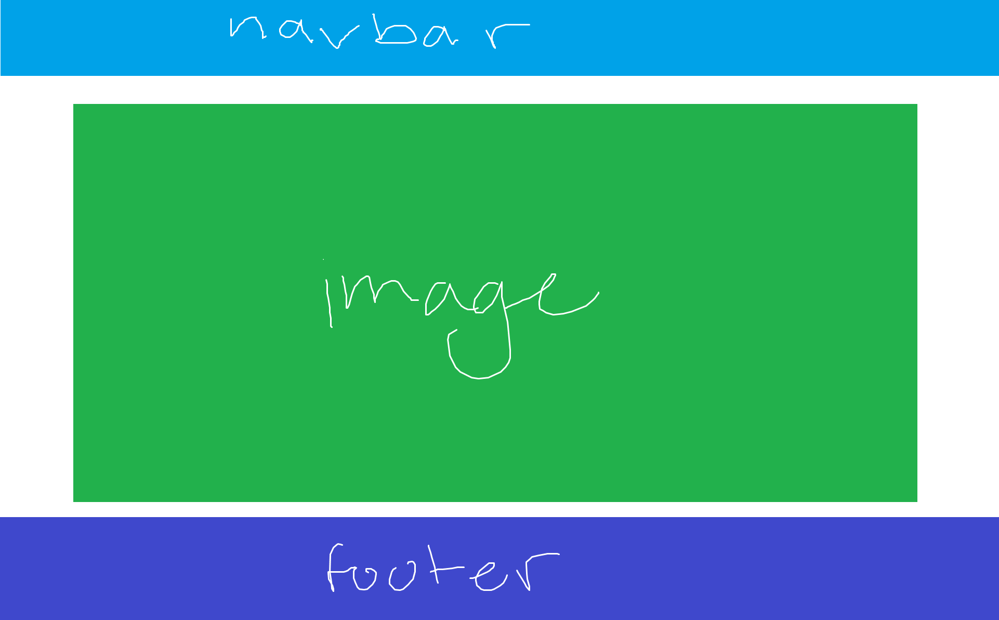
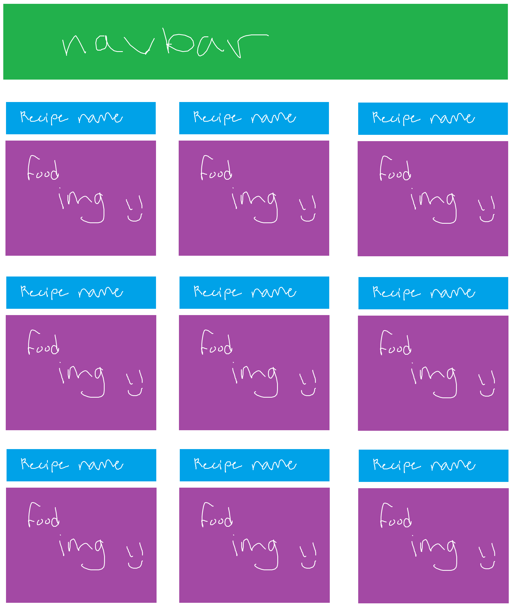
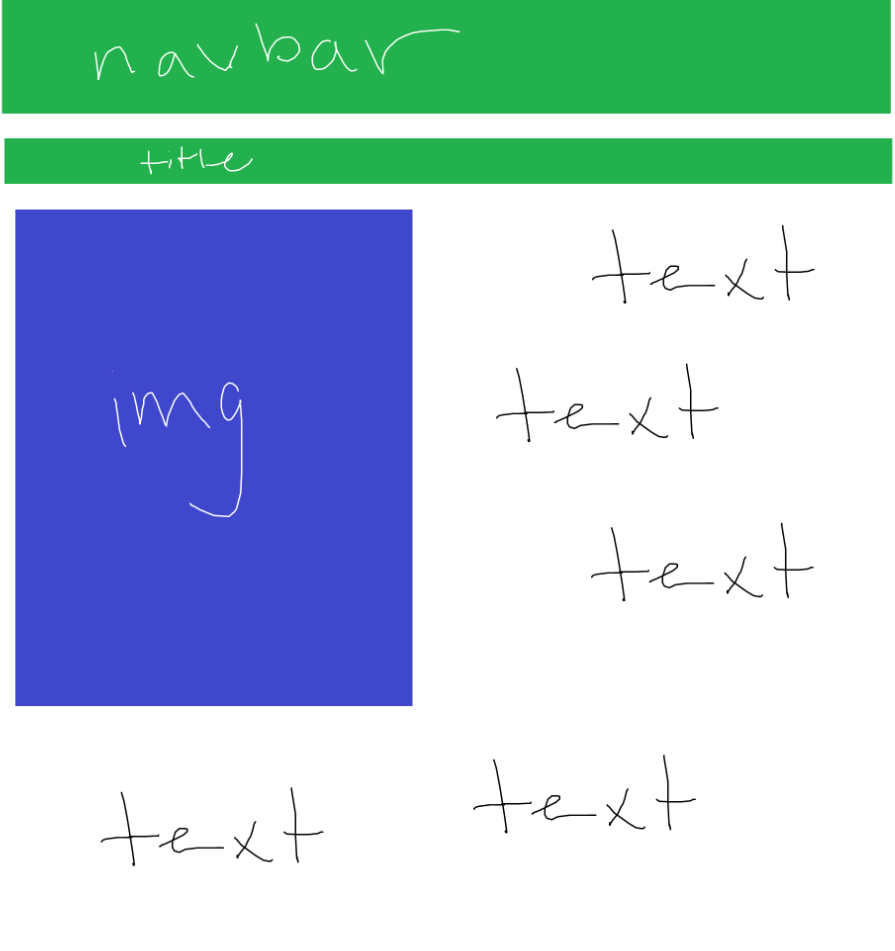
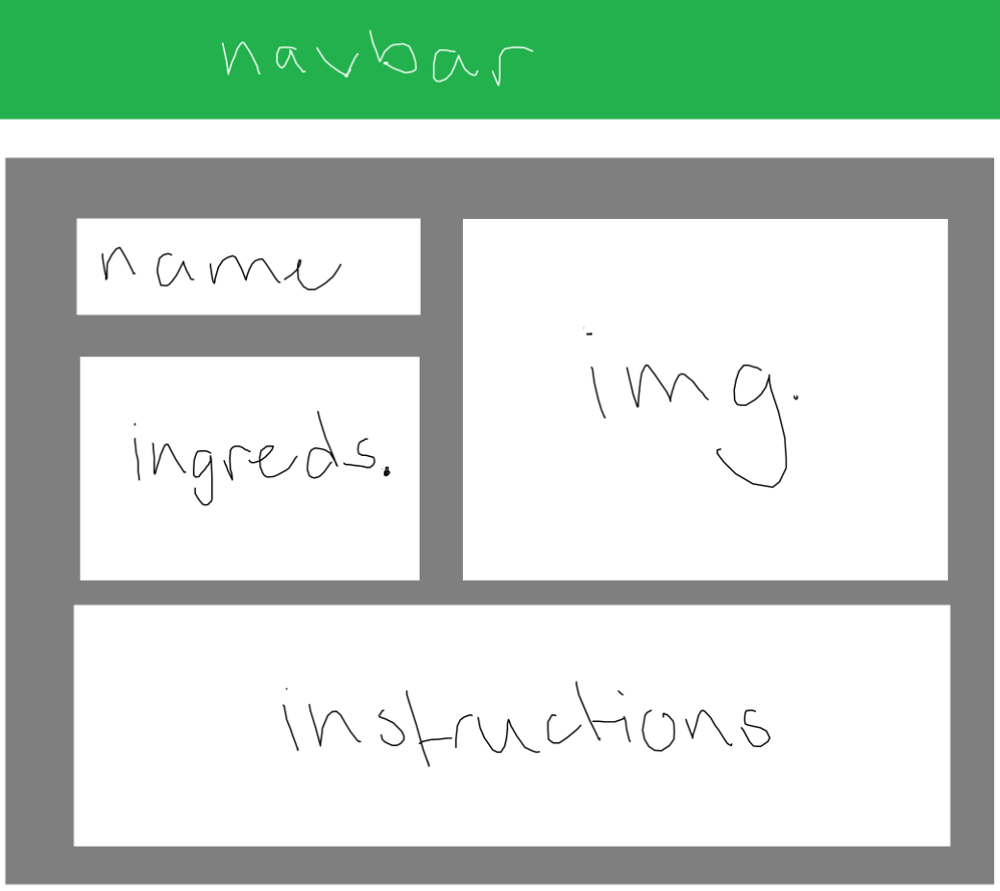

## **Table of Contents**
* Overview
* Meet the Developers
* The Techy Stuff
* Mockups

## **Overview**
Cooking Compass is an application that allows UH Mānoa students to share and search for creative recipes that respect the constraints—limited kitchen resources, cooking skills, time—many college-goers face. By providing opportunites to find creative, *doable* recipes, we aim to foster a community that celebrates resourcefulness, healthy eating, and the joy of cooking.

## **Meet the Developers**

## **The Techy Stuff**
* See our [GitHub Organization](https://github.com/Cooking-Compass).
* See our [team contract](https://docs.google.com/document/d/1vPueASUJx5Af_aTIyjsdGVoajnHm5Qxhm5PrnRTxdoA/edit?usp=sharing).
* See our [deployment page](https://cooking-compass-khaki.vercel.app/). (Just placed here for now.)

## **Milestones**
* [Project Milestone 1](https://github.com/orgs/Cooking-Compass/projects/1)
* [Project Milestone 2](https://github.com/orgs/Cooking-Compass/projects/2)

## **Mockups**
## **Homepage**

#### Recipe Page

#### Individual Recipe Page

#### Recipe Submit Page

