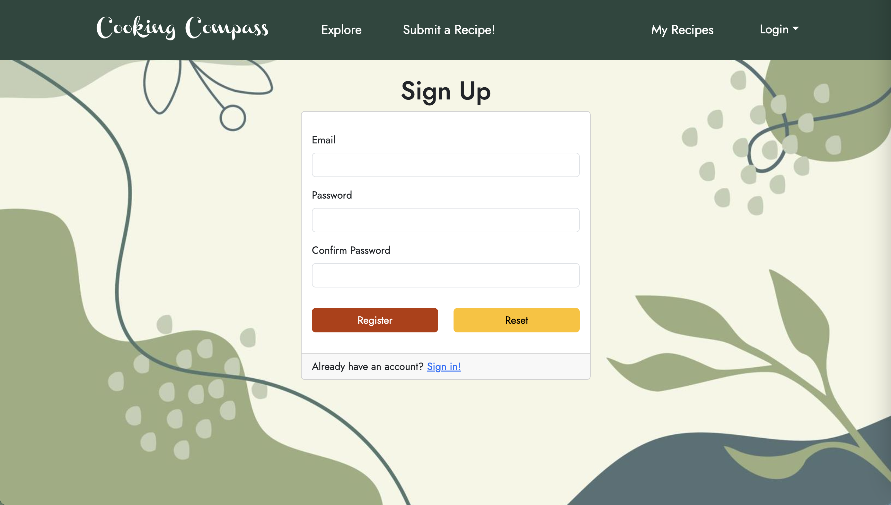
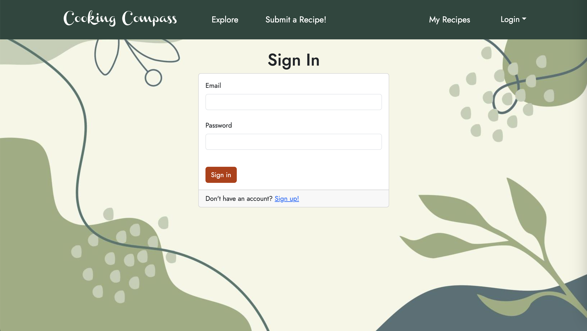
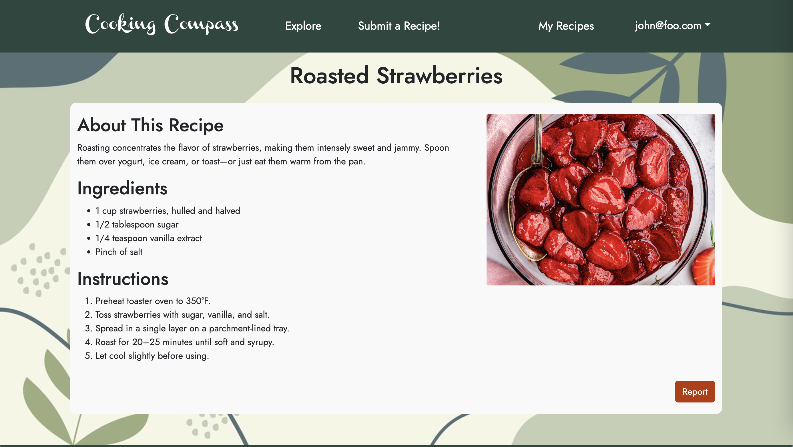
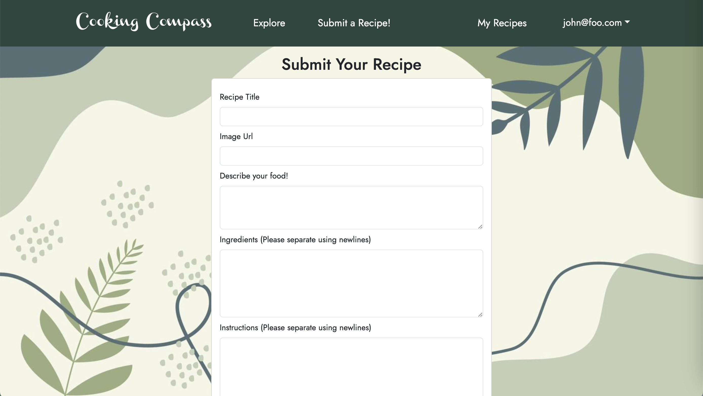
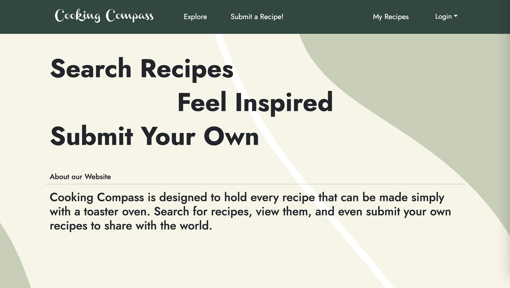
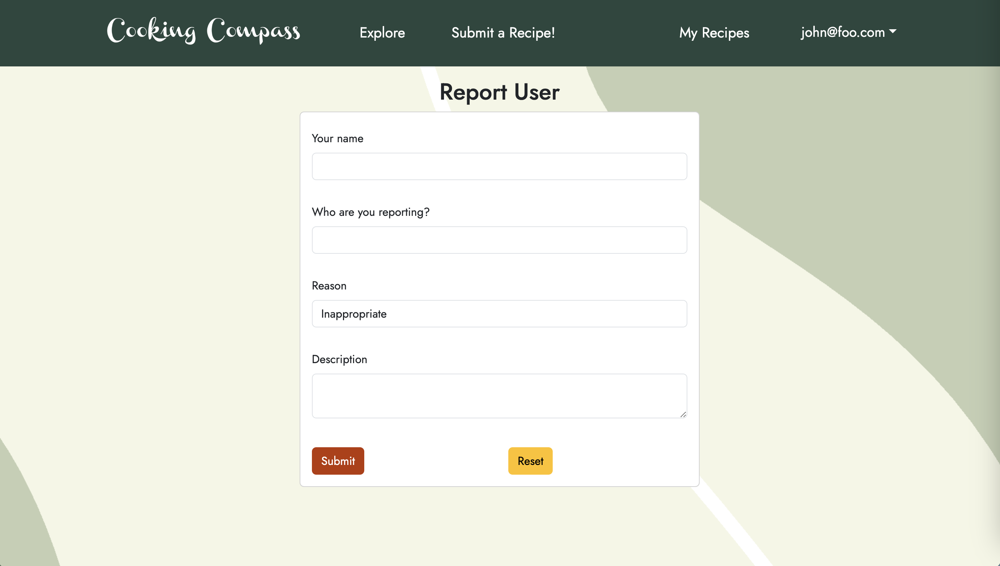
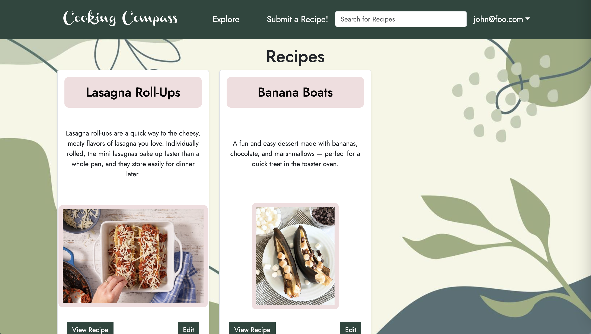

## **Table of Contents**
* [Overview](#overview)
* [The Techy Stuff](#the-techy-stuff)
* [Mockups](#mockups)
* [Deployment](#deployment)
* [Installment Guide](#wish-to-install-and-view-our-program)
* [User Interface Walkthrough](#user-interface-walkthrough)
* [Community Feedback](#community-feedback)
* [Meet the Developers](#meet-the-developers)


## **Overview**
Cooking Compass is an application that allows UH Mānoa students to share and search for creative recipes that respect the constraints—limited kitchen resources, cooking skills, time—many college-goers face. By providing opportunites to find creative, *doable* recipes, we aim to foster a community that celebrates resourcefulness, healthy eating, and the joy of cooking.


## **The Techy Stuff**
* See our [GitHub organization](https://github.com/Cooking-Compass).
* See our [team contract](https://docs.google.com/document/d/1vPueASUJx5Af_aTIyjsdGVoajnHm5Qxhm5PrnRTxdoA/edit?usp=sharing).


## **Milestones**
* [Project Milestone 1](https://github.com/orgs/Cooking-Compass/projects/1)
* [Project Milestone 2](https://github.com/orgs/Cooking-Compass/projects/2)
* [Project Milestone 3](https://github.com/orgs/Cooking-Compass/projects/3)

<hr>

## **Mockups**

<div style="display: flex; flex-wrap: wrap; gap: 40px; justify-content: center;">

  <div style="flex: 1 1 45%; text-align: center;">
    <h3><strong>Sign-up Page</strong></h3>
    
  </div>

  <div style="flex: 1 1 45%; text-align: center;">
    <h3><strong>Sign-in Page</strong></h3>
    
  </div>

  <div style="flex: 1 1 45%; text-align: center;">
    <h3><strong>Individual Recipe Page</strong></h3>
    
  </div>

  <div style="flex: 1 1 45%; text-align: center;">
    <h3><strong>Recipe Submit Page</strong></h3>
    
  </div>

</div>

<br>

<div style="text-align: center">
  <h3><strong>Landing Page</strong></h3>
  
</div>

<br>
<hr>

## **Deployment**

* [Vercel Deployment](https://cooking-compass-khaki.vercel.app/)
* [](https://github.com/Cooking-Compass/cooking-compass/actions/workflows/ci.yml)

<br>
<hr>

## **Wish to install and view our program?**

First, you'll want to clone the repository to your own desktop. That requires permitted access so feel free to request access. 
The link to the repository can be found [here](https://github.com/Cooking-Compass/cooking-compass).

Second, as this uses postgres to create and maintain databases, you'll need to install it. You can install it through [here](https://www.postgresql.org/download/). 

Once you open the repository into your environment, proceed to the terminal and create that database. 

```

$ createdb testing
Password: (enter password here)
$

```

NPM and Node.js is both needed for this, so have those too. Then you can proceed to terminal and type:

```

$ npm install

```

After that, create a `.env` file from the `sample.env`. Set the `DATABASE_URL` variable to match your PostgreSQL database that you created in the first step. See the Prisma docs [Connect your database](https://www.prisma.io/docs/getting-started/setup-prisma/add-to-existing-project/relational-databases/connect-your-database-typescript-postgresql). Then run the Prisma migration `npx prisma migrate dev` to set up the PostgreSQL tables.

```

$ npx prisma migrate dev
Environment variables loaded from .env
Prisma schema loaded from prisma/schema.prisma
Datasource "db": PostgreSQL database "<your database name>", schema "public" at "localhost:5432"

Applying migration `20240708195109_init`

The following migration(s) have been applied:

migrations/
└─ 20240708195109_init/
└─ migration.sql

Your database is now in sync with your schema.

✔ Generated Prisma Client (v5.16.1) to ./node_modules/@prisma/client in 51ms

$

```

### **Now, here is how to start it up locally:**

Once the libraries are installed and the database seeded, you can run the application by invoking the "dev" script in the [package.json file](https://github.com/ics-software-engineering/nextjs-application-template/blob/master/app/package.json):

```

$ npm run dev

> nextjs-application-template-1@0.1.0 dev
> next dev

▲ Next.js 14.2.4

- Local: http://localhost:3000
- Environments: .env

✓ Starting...
✓ Ready in 1619ms

```

### **Viewing the running app:**

If all goes well, the application will appear at [http://localhost:3000](http://localhost:3000). You can login using the credentials in [settings.development.json](https://github.com/ics-software-engineering/nextjs-application-template/blob/main/config/settings.development.json), or else register a new account.

### **ESLint**

You can verify that the code obeys our coding standards by running ESLint over the code in the src/ directory with:

```
$ npm run lint

> nextjs-application-template-1@0.1.0 lint
> next lint

✔ No ESLint warnings or errors
$
```

<br>
<hr>

## **User Interface Walkthrough**

### **Landing Page**

When you first bring up the application, you will see the landing page that provides a brief introduction to the capabilities of Cooking Compass:


<br>

### **About**

Clicking on the 'About Us' link brings up a page containing information about the app, our vision, and frequently asked questions.



<br>

### **Sign Up**

If you do not yet have an account on the system, you can register by clicking on 'Login', then 'Sign Up':


<br>

### **Sign In**

Click on the Login link, then click on the Signin link to bring up the Sign In page which allows you to login:


<br>

### **Submit Recipe**

After successfully logging in, the user will be taken back to the homepage, but now they will be able to submit recipes. Clicking on the 'Submit a Recipe' link will bring up this page:


<br>

### **Explore**

Clicking on the 'Explore' button brings up a page that lists all of the recipes that have been submitted to the application. Each card has a preview of the dish, including an image and description.


<br>

### **Individual Recipe**

From the Explore page, the user can click on the 'View Recipe' button for the recipe they would like to know more about. This brings up a page that now also lists the ingredients and instructions for that recipe.


<br>

### **Report Recipe**

A recipe may not always be suitable for the Cooking Compass community. Clicking the 'Report' button on a recipe page allows the user to alert the admins of potential violations.



<br>

### **My Recipes**

The user can click the 'My Recipes' button on the navigation bar to view the recipes they have submitted. This page allows them to edit or delete their submissions.



<br>
<hr>

## **Community Feedback**

### **What did you like about Cooking Compass? Is it convenient? Would you use it?**

* "I liked how easy it is to follow and use! I would definitely use this to look at other people's recipes." 
* "Most of it I liked; mainly the structure and the design. I would use this and spread this to other people."

<br>

### **Tell us how Cooking Compass could be better.**

* "Try to make the spacing between the pictures and descriptions of the receipies not funky."
* "The comma structure was not the best option. Try to use some less common grammatical symbol/device like a ';'."
* "Clearer instructions on how to write the instructions for each recipe."

<br>
<hr>

## **Meet the Developers**

<div>
  <table style="margin: 0 auto; border-collapse: separate; border-spacing: 10px;">
    <tr>
      <td style="width: 200px; vertical-align: top; text-align: center;">
        <h3 style="margin-bottom: 10px;">Derrick</h3>
        <br>
        <p style="font-size: 13px; margin-top: 8px;">
          Majoring in ICS to eventually be in Game Development.
        </p>
      </td>
      <td style="width: 200px; vertical-align: top; text-align: center;">
        <h3 style="margin-bottom: 10px;">Jasmine</h3>
        <br>
        <p style="font-size: 13px; margin-top: 8px;">
        Majoring in ICS and minoring in Philosophy.
        <a href="https://www.linkedin.com/in/jasminequach/" target="_blank">LinkedIn</a>
        </p>
      </td>
      <td style="width: 200px; vertical-align: top; text-align: center;">
        <h3 style="margin-bottom: 10px;">Martin</h3>
        <br>
        <p style="font-size: 13px; margin-top: 8px;">
        Majoring in Astrophysics and minoring in ICS.
        <a href="https://www.linkedin.com/in/martin-adra-40a06b1b9" target="_blank">LinkedIn</a>
        </p>
      </td>
      <td style="width: 200px; vertical-align: top; text-align: center;">
        <h3 style="margin-bottom: 10px;">Binh</h3>
        <br>
        <p style="font-size: 13px; margin-top: 8px;">
        Majoring in ICS with an interest in Cybersecurity.
          <a href="https://www.linkedin.com/in/binhntrann/" target="_blank">LinkedIn</a>
        </p>
      </td>
    </tr>
  </table>
</div>
