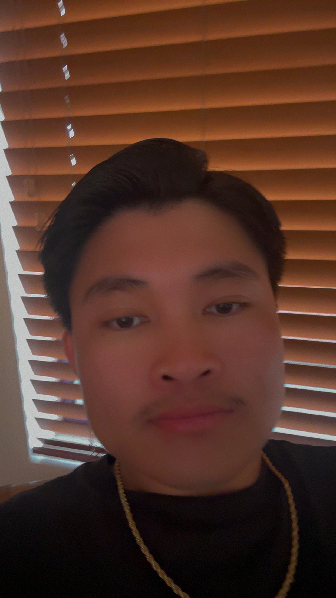

## **Table of Contents**
* [Overview](#overview)
* [The Techy Stuff](#the-techy-stuff)
* [Mockups](#mockups)
* [Deployment](#deployment)
* [User Guide](#user-guide)
* [Meet the Developers](#meet-the-developers)

## **Overview**
Cooking Compass is an application that allows UH Mānoa students to share and search for creative recipes that respect the constraints—limited kitchen resources, cooking skills, time—many college-goers face. By providing opportunites to find creative, *doable* recipes, we aim to foster a community that celebrates resourcefulness, healthy eating, and the joy of cooking.

## **The Techy Stuff**
* See our [GitHub organization](https://github.com/Cooking-Compass).
* See our [team contract](https://docs.google.com/document/d/1vPueASUJx5Af_aTIyjsdGVoajnHm5Qxhm5PrnRTxdoA/edit?usp=sharing).
* See our [deployment page](https://cooking-compass-khaki.vercel.app/). (Just placed here for now.)

## **Milestones**
* [Project Milestone 1](https://github.com/orgs/Cooking-Compass/projects/1)
* [Project Milestone 2](https://github.com/orgs/Cooking-Compass/projects/2)

## **Mockups**

  

    <h3><strong>Homepage</strong></h3>
    
  

  

    <h3><strong>Sign-in Page</strong></h3>
    
  

  

    <h3><strong>Individual Recipe Page</strong></h3>
    
  

  

    <h3><strong>Recipe Submit Page</strong></h3>
    
  

## **Deployment**

* [Vercel Deployment](https://cooking-compass-khaki.vercel.app/)

## **User Guide**
TO-DO!

## **Meet the Developers**

  <table style="margin: 0 auto;">
    <tr>
      <td style="padding: 10px; vertical-align: top;">
        <h3>Derrick</h3>
         
        

        This is the homepage of the app.
        

      </td>
      <td style="padding: 10px; vertical-align: top;">
        <h3>Jasmine</h3>
        
        

        This is the homepage of the app.
        

      </td>
      <td style="padding: 10px; vertical-align: top;">
        <h3>Martin Adra</h3>
         
        

        Majors in Astrophysics and Minors in ICS
        <a href="https://www.linkedin.com/in/martin-adra-40a06b1b9" target="_blank">Martin Adra</a>
        

      </td>
      <td style="padding: 10px; vertical-align: top;">
        <h3>Binh</h3>
         
        

        This is the homepage of the app.
        

      </td>
    </tr>
  </table>

